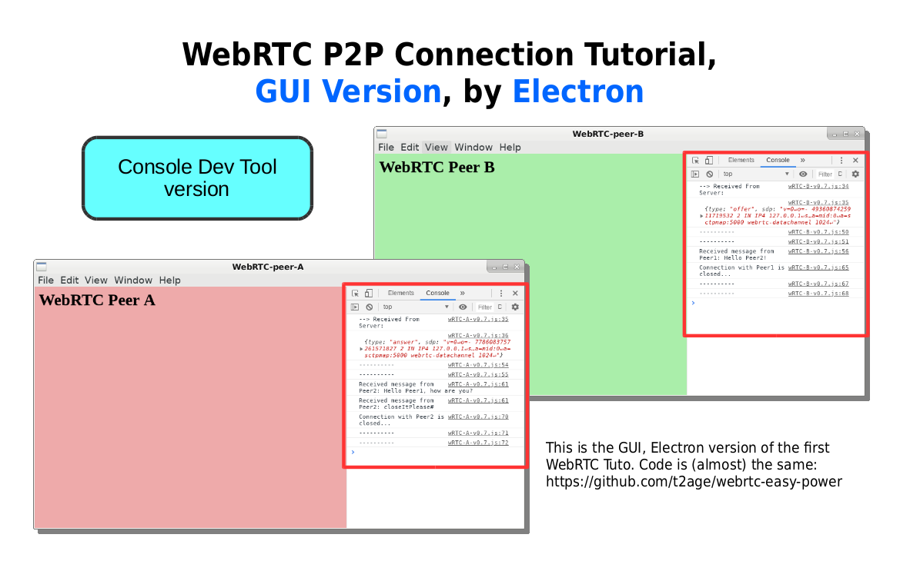
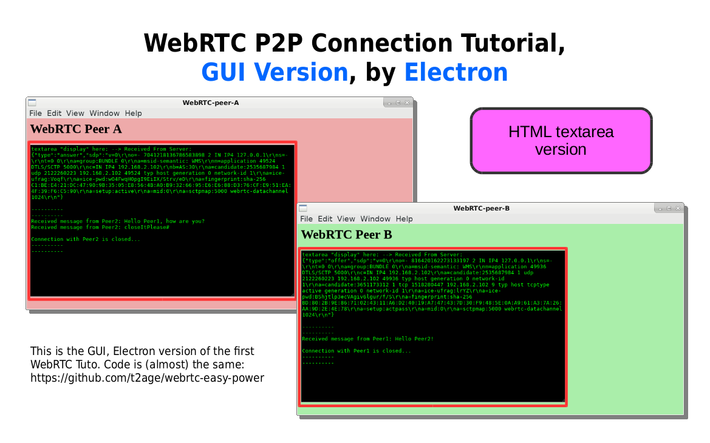
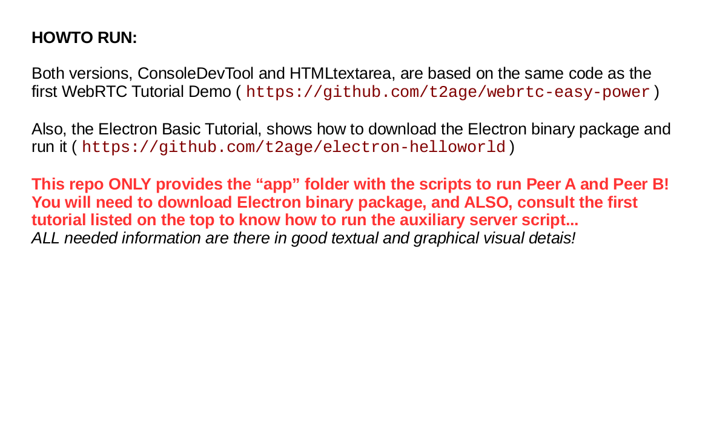
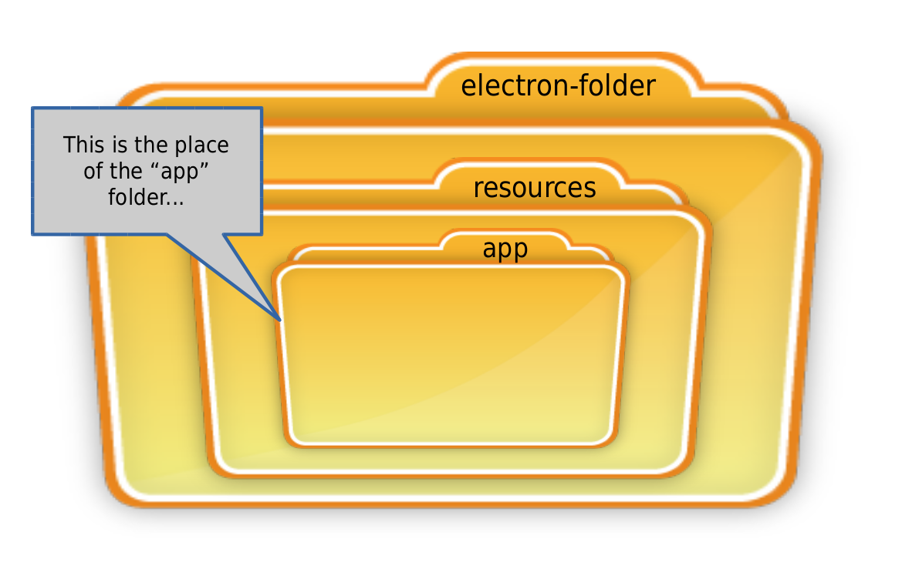

# p2p-wrtc-gui-app
This is the very first WebRTC tuto, in GUI Application version  
  

  
---

  
---

  
---

  
---
  
**This repository covers the following 2 Demos/Tutorials**  
  
**1. Console Dev Tools version**  
**2. HTML textarea myConsole**  
  
  
---  
0. All 6 tutos below are based* on WRTC Easy Power Tutorial  
  
1. Console Dev Tools version  
  
2. HTML textarea myConsole  
  
3. P2P Send File  
  
4. P2P WebCam Photo (fswebcam)  
  
5. P2P Screenshot (scrot)  
  
6. P2P Walk Talk (arecord)  
  
-----------------  
Above series of 6 tutos are part of the Webelive Tutorials, which are focused on communication, but, they depart a little bit from the previous ones, because on the present 6, the subject of CODING, also, became an important subject for the tutorials. In other words, the subject of CODING is also a small part and goal of the tutorial itself.  
  
The CODING portion of the present 6 tutos are centered around JavaScript and Electron platform, and how powerful can be apps that uses the full power of the Operating System.  
  
By interacting with files and invoking apps, Electron Framework add full O.S. capabilities to the WebRTC Data Channel, together with Graphical User Interface as easy as HTML...  
-----------------  
  
*Based on following Tutorials:  
	WebRTC Easy Power  
	Electron Basic Tutorial  
  
Howto about Electron Framework GUI can be found on the Electron Basic Tutorial.  
Howto WebRTC Connection can be found on the WebRTC Easy Power Tutorial.  
  
  
